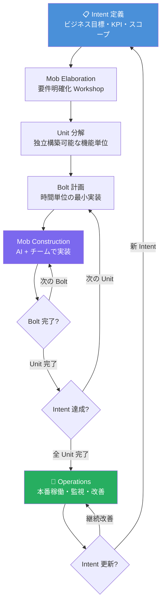
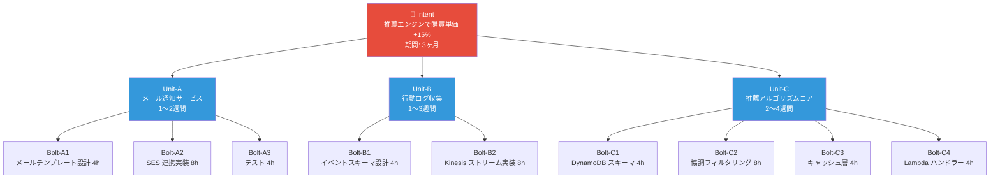
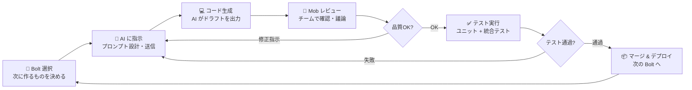
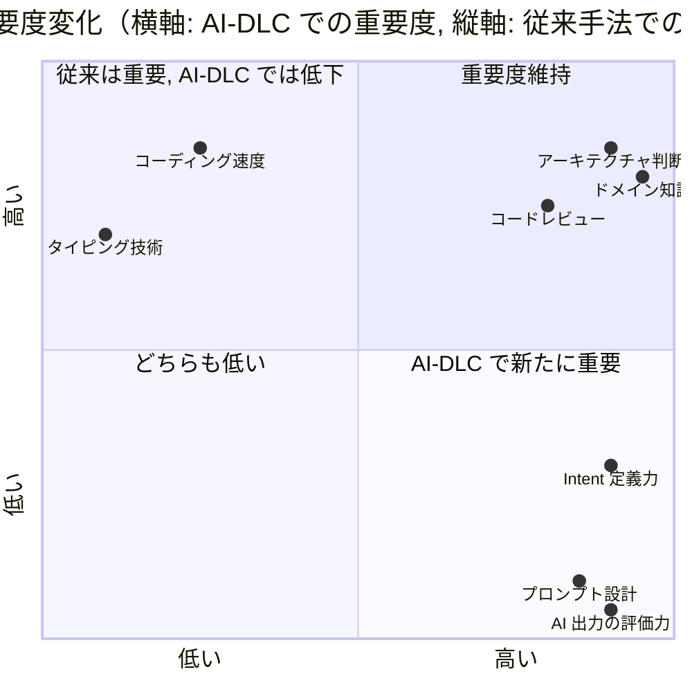
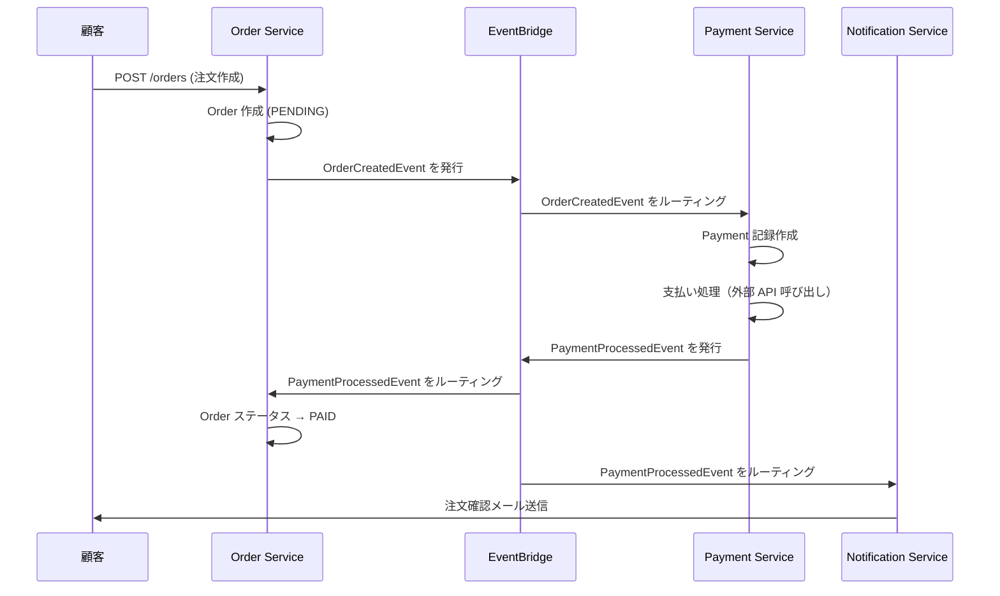
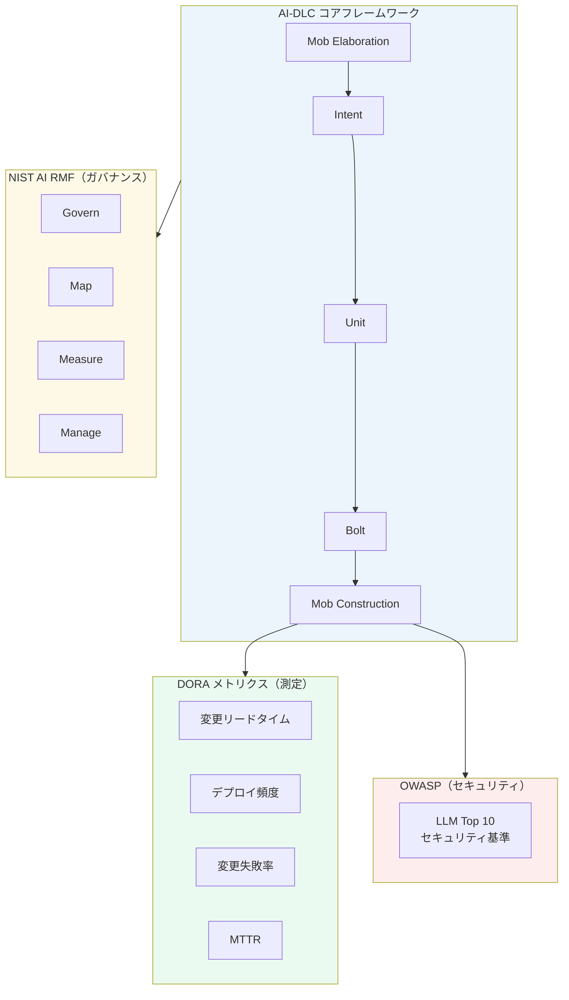
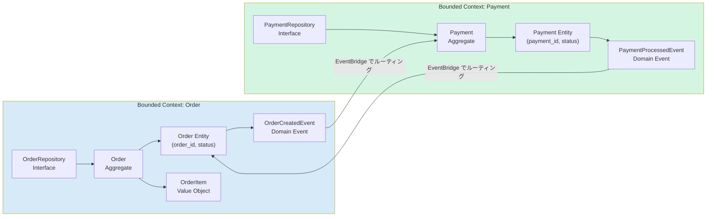

# H: AI-DLC 概念図・全体像ダイアグラム

テキストだけでは掴みにくい AI-DLC の構造を、Mermaid 図で視覚的に整理。

---

## 1. AI-DLC 全体フロー



---

## 2. Intent → Unit → Bolt の階層構造



---

## 3. Mob Construction のサイクル



---

## 4. 従来手法 vs AI-DLC の役割マッピング



---

## 5. マイクロサービス Event 駆動フロー（実践例_04 の図解）



---

## 6. AI-DLC と外部フレームワークの関係



---

## 7. 学習フェーズのマップ

```mermaid
journey
    title AI-DLC 学習の旅
    section フェーズ1: 理解
      ロードマップを読む: 5: 学習者
      概念図を見る: 5: 学習者
      実践ガイドを通読: 4: 学習者
      用語集を参照: 3: 学習者
    section フェーズ2: 体験
      実践例01を読む: 4: 学習者
      AIで架空シナリオを試す: 3: 学習者
      プロンプト設計を学ぶ: 4: 学習者
      実践例02のコードを動かす: 3: 学習者
    section フェーズ3: 実践
      チームでMob Elaborationを実施: 3: 学習者, チーム
      振り返りとアンチパターン確認: 4: 学習者, チーム
      DORA メトリクスで測定: 4: チーム
      継続改善: 5: チーム
```

---

## 8. DDD の主要概念の関係図



---

## 図の見方のポイント

| 図番号 | 何を理解するために使う |
|--------|---------------------|
| 1. 全体フロー | 「AI-DLC はどんな順番で進むのか」 |
| 2. 階層構造 | 「Intent・Unit・Bolt の大きさの違い」 |
| 3. Mob Construction サイクル | 「1 Bolt を実装するときの流れ」 |
| 4. 役割変化 | 「何のスキルが重要になるか」 |
| 5. Event 駆動フロー | 「マイクロサービス間の非同期通信」 |
| 6. フレームワーク関係 | 「AI-DLC と DORA/NIST/OWASP の位置関係」 |
| 7. 学習マップ | 「自分がどのフェーズにいるか」 |
| 8. DDD 概念 | 「Entity・Aggregate・Domain Event の関係」 |
